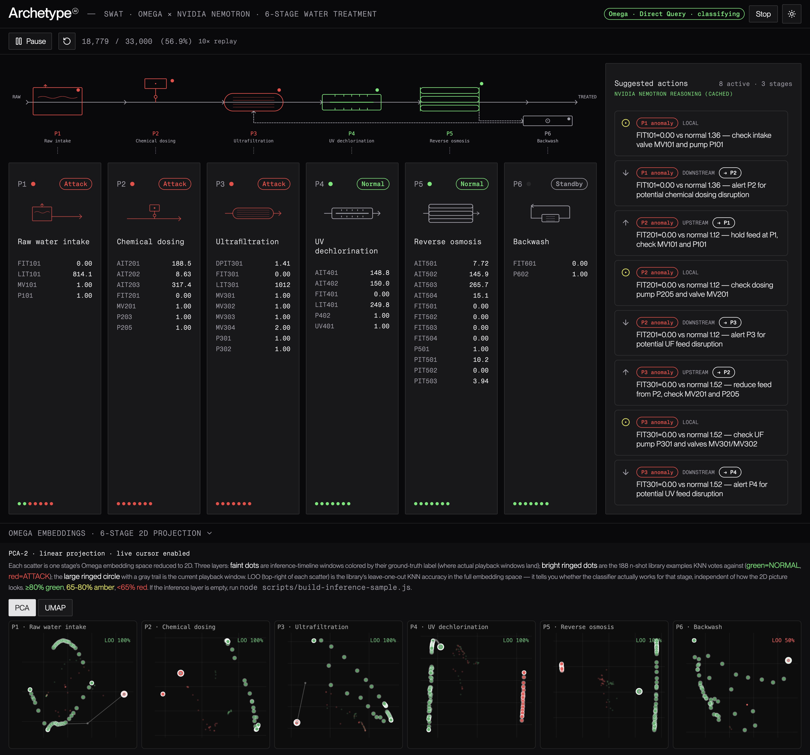
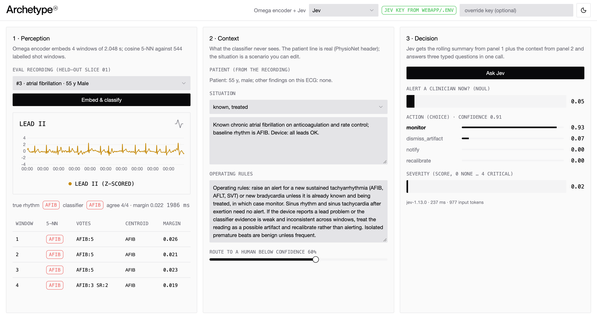

# pagesnap

Full-page screenshots of web apps in one image: no scrolling, no stitching, no browser extension.

Built for sharing the apps you're working on. It captures the page exactly as you have it in the browser
(selected options, results, panel state), including content below the fold and inside scrolling panels.

## Examples

A dark dashboard captured in full, from the header down to the scatter plots below the fold:

An app captured after interacting with it, with the results still on screen:

## Setup

Requires Node.js and Google Chrome (macOS). The command is `snap`.

    npm install && npx playwright install chromium
    npm link            # optional: makes `snap` available everywhere

## Capture the page as you have it (recommended)

    snap --browser localhost:5174   # opens a dedicated Chrome window; use your app there
    snap                            # captures the visible tab exactly as it is, no reload
    snap localhost:5174 --copy      # or pick the tab by url, and copy to clipboard

The window uses its own Chrome profile (`.chrome-profile/`), separate from your main one, so it works
where browser extensions are blocked. Logins in that window are remembered.

## Load a url fresh in a hidden browser

Used automatically when no `snap --browser` window is open.

    snap myapp.com --mobile --open  # phone layout, open in Preview
    snap myapp.com --login          # log in once; later fresh captures reuse the session

## Options

    -o, --out <file>     Output PNG path (default: screenshots/<host>-<time>.png)
    -w, --width <px>     Page width (default: current window width, or 1440 when loading fresh)
        --mobile         Capture as a phone (390px wide)
    -s, --scale <n>      Pixel density (default: 3)
        --wait <ms>      Extra wait before capturing
        --open           Open the result in Preview
    -c, --copy           Copy the result to the clipboard

## How it works

- Uses [Playwright](https://playwright.dev) to drive Chrome and capture the full page in one render.
- Scrolls through the page first so lazy-loaded content appears.
- Apps that scroll inside a container (sidebar plus main panel layouts) are expanded so the whole panel is captured.
- Very long pages automatically use a slightly lower resolution so Chrome renders them without gaps.
- Open tabs are left as they were found, including scroll positions.

Note: while the `snap --browser` window is open, local programs can control it through port 9222.
Don't use it for sensitive accounts, and close it when you're done.
